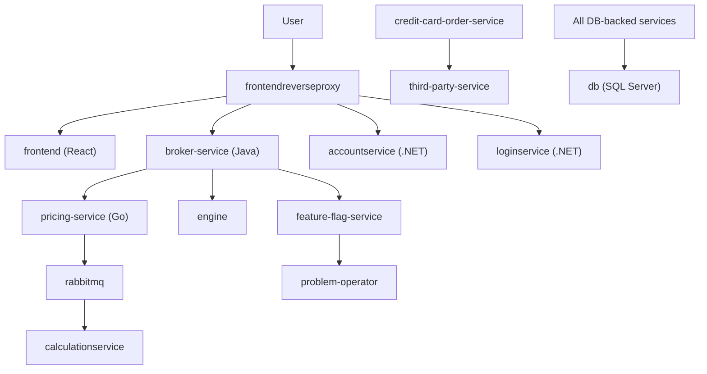

# EasyTrade Architecture

EasyTrade is a 19-microservice stock trading platform built with .NET, Java, Go, and Node.js.

## Service Interaction

## Services

| Service | Tech | Role |
|---------|------|------|
| `frontend` | React/Nginx | Web UI |
| `frontendreverseproxy` | Nginx | Routes traffic to backend services |
| `broker-service` | Java | Executes trades |
| `pricing-service` | Go | Real-time stock pricing, publishes to RabbitMQ |
| `accountservice` | .NET | User account management |
| `loginservice` | .NET | Authentication |
| `offerservice` | .NET | Stock offers, checks feature flags |
| `calculationservice` | .NET | Consumes trade data from RabbitMQ |
| `aggregator-service` | .NET | Aggregates data from offer service |
| `credit-card-order-service` | Java | Credit card lifecycle management |
| `third-party-service` | Java | Simulates external card manufacturer/courier |
| `contentcreator` | Java | Populates initial database content |
| `engine` | .NET | Trading engine, drives broker-service |
| `manager` | .NET | Service management and health |
| `feature-flag-service` | .NET | Controls feature flags for failure patterns |
| `problem-operator` | Go | Polls flags, applies chaos effects to deployments |
| `loadgen` | Go | Generates synthetic user traffic |
| `db` | SQL Server | Persistent data store (StatefulSet) |
| `rabbitmq` | RabbitMQ | Message broker for pricing → calculation pipeline |

## Data Flow

1. **User traffic** enters through `frontendreverseproxy` which routes to `frontend` (UI) and backend APIs
2. **Trading flow:** `engine` → `broker-service` → `pricing-service` → `rabbitmq` → `calculationservice`
3. **Credit cards:** `credit-card-order-service` ↔ `third-party-service` (simulated external)
4. **Observability:** `feature-flag-service` stores flags, `problem-operator` polls and applies effects
5. **Load generation:** `loadgen` sends synthetic requests to `frontendreverseproxy`

## Helm Chart

The chart at `helm/easytrade/` uses a **subchart pattern** — a shared `app` chart is aliased once per service. All configuration lives in `values.yaml`. Each service can set:

- `enabled` — deploy or skip
- `image.repository` / `image.tag` — container image
- `env` / `envFromSecret` — environment variables
- `resources` — CPU/memory requests and limits
- `service` — ClusterIP service configuration

---

[Back to README](../README.md)
